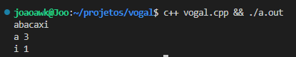

# Listing Vowels

This software calculates the absolute frequency of every vowel in a word

## Where did the idea come up from?

This software was designed as a college assignment
in which we should print vowel and its absolute frequency
A-Z ordered.

## How it works?

It was made in C++ and you can just compile it, run it by passing an text argument in command line or just type in some text to get counted, as shown in the image

